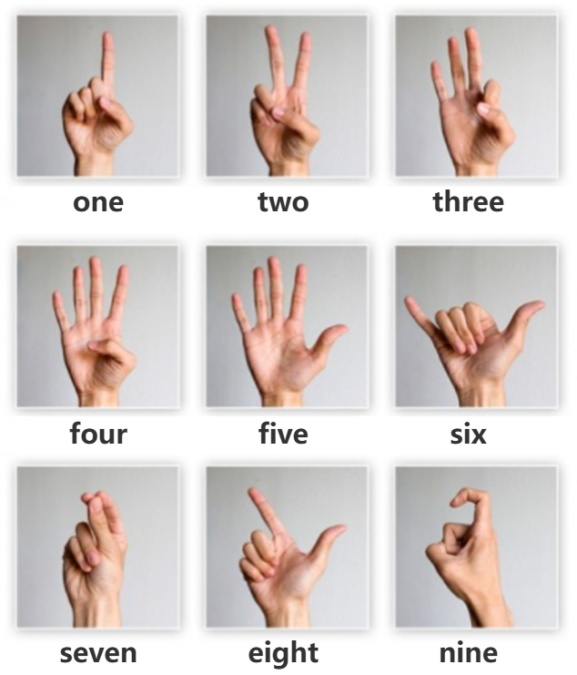

# 🌌 Web-based Interactive Particle Solar System 
> **Explore the Universe through Real-time Hand Gestures**


🌍 **Experience it live:** [https://derpzhenjun.github.io/Web-based-Interactive-Particle-Solar-System/](https://derpzhenjun.github.io/Web-based-Interactive-Particle-Solar-System/)

---

## 📺 Video Demonstration

> **[Video Coming Soon]** > *A full demonstration video showcasing the real-time hand tracking and particle physics will be uploaded here shortly. Stay tuned!*

---

## 🌟 Project Overview

This project transforms the standard web experience into a touchless, immersive journey through space. By leveraging millions of particles and custom GLSL shaders, it simulates complex planetary phenomena—from Saturn's Keplerian rings to Jupiter's differential rotation. Integrating **MediaPipe** for computer vision, the engine translates your real-time hand gestures into seamless cosmic navigation.

- **High-Performance Shaders**: Millions of particles rendered smoothly at 60FPS using React-Three-Fiber.
- **Touchless Navigation**: A highly accurate, debounced gesture recognition system.
- **Scientific Accuracy**: Orbital velocities, axial tilts, and planetary features based on real-world physics and mathematical formulas.

---

## 🖐️ Gesture Controls

The navigation system utilizes a custom "Strict State" detection algorithm to prevent accidental triggers during hand movement transitions. Use your camera to control the cosmos:

Here is a visual reference for the corresponding hand gestures:


### 🪐 Planetary Navigation (1-9)
- ☝️ **1 Finger (Index Up)**: Travel to the **Sun**.
- ✌️ **2 Fingers (Victory)**: Visit **Mercury**.
- 🤟 **3 Fingers**: Navigate to **Venus**.
- 🖐️ **4 Fingers (Spread, Thumb In)**: Explore **Earth**.
- ✋ **5 Fingers (Full Open Hand)**: Travel to **Mars**.
- 🤙 **6 (Hang Loose)**: Close-up of **Jupiter**.
- 🤌 **7 (Three-Finger Pinch)**: Observe **Saturn**.
- 👉 **8 (Index & Thumb Out)**: Glide to **Uranus**.
- 🪝 **9 (Index Hook)**: Dive into **Neptune**.

### 🎮 System Controls
- 🛑 **Four Fingers Closed (Stop)**: Return to **Home / Solar System Overview**.
- 🤏 **Pinch & Move**: Dynamic Scaling, Zooming, and panning around the current planet.
- 🖖 **Vulcan Greeting**: *[Hidden Easter Egg]* Try this while looking at Earth!

---

## 🚀 Technical Highlights

The engine utilizes custom **Vertex** and **Fragment Shaders** to implement unique features for each celestial body, completely bypassing standard 3D geometries and textures.

| Celestial Body | Scientific Feature | Shader & Tech Implementation |
| :--- | :--- | :--- |
| **SUN** | Photosphere & Corona | Particle-based boiling convection via high-frequency jitter & Fresnel glow. |
| **MERCURY** | Ionized Sodium Tail | Vector-based particle trailing with exponential transparency decay. |
| **VENUS** | Atmospheric Super-rotation | Differential rotation logic and 3D Perlin Noise for "Y-shaped" clouds. |
| **EARTH** | Lunar Tides | Real-time gravity-based deformation using vector dot products. |
| **MARS** | Valles Marineris | Non-spherical coordinate manipulation to simulate deep canyon rifts. |
| **JUPITER** | Differential Rotation | Latitudinal velocity slicing using sine-based wind zone functions. |
| **SATURN** | Keplerian Rings | Physics-accurate orbital velocity calculated via $1/\sqrt{R}$. |
| **URANUS** | 98° Axial Tilt | Side-rolling coordinate transformation via a 1.71 radian rotation matrix. |
| **NEPTUNE** | Supersonic Storms | 3D Hash Noise combined with time-based fluid dynamic striations. |

---

## 🛠️ Installation & Running

Want to run the universe locally on your machine? Follow these steps:

1. **Clone the repository:**
   ```bash
   git clone [https://github.com/DerpZhenjun/Web-based-Interactive-Particle-Solar-System.git](https://github.com/DerpZhenjun/Web-based-Interactive-Particle-Solar-System.git)
   cd Web-based-Interactive-Particle-Solar-System

2.  **Install dependencies:**
    ```bash
    npm install
    ```
3.  **Launch the universe:**
    ```bash
    npm run dev
    ```

-----

## 🚧 Roadmap & WIP

I am continuously refining the project. Current work-in-progress items include:

  - [x] Global gesture debouncing and transition "deadzones".
  - [x] Full-screen responsive canvas without scrollbars.
  - [ ] **Dynamic HUD**: Floating holographic UI for displaying planetary data.
  - [ ] **Milky Way Shader**: Procedurally generated galactic background for the overview.

-----

**Developed by [@DerpZhenjun](https://www.google.com/search?q=https://github.com/DerpZhenjun)** *Crafted with ✨, C/C++ logic, and Star-dust.*
